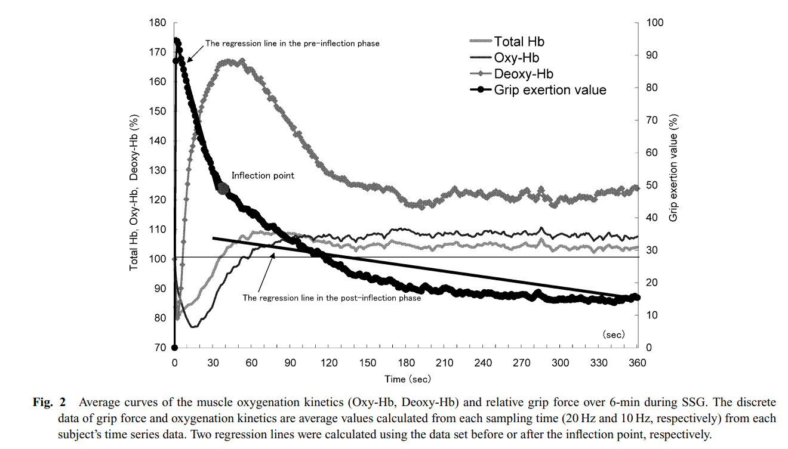

# OT

Aplicación para calcular el umbral de oclusión (OT) a partir de un test de fuerza 9s/1s durante nueve repeticiones.

El test debe realizarse con un sensor de fuerza, sobre la regleta obtenida con MED-40, realizando toda la fuerza posible.

Los reposos deben ser muy cortos, menos de un segundo, simplemente para poder recolocar la mano.

## Análsis del método de cálculo

Entiendo que este método surge del estudio de [Yamaji y col., (2004)](https://www.researchgate.net/publication/8634784_Relationships_between_Decreasing_Force_and_Muscle_Oxygenation_Kinetics_during_Sustained_Static_Gripping), donde ellos realizaron el test sin solar en ningún momento, validando con un NIRS la disminución de oxigenación en el músculo.

Para calcular el OT dicho paper usa el siguiente método:

The inflection point (time) was determined by the following conditions:

1. The time series sustained force data (360 data) was
   divided into the former and latter phases at all combinations
   (e.g. the former: the latter, 3: 357, 4: 356,..., 356: 4, 357: 3),
   and respective regression lines were calculated (see Figure 2).

2. The best fit regression lines were determined by the
   following conditions: the regression coefficients (a1) in the
   pre-inflection phase were significant and greater than the
   regression coefficients (a2) in any other post-inflection phase,
   and the sum of the determination coefficients of both
   regression equations was highest.

3. The inflection point was determined as the time
   corresponding to the boundary point between the former and
   latter time series data when combining the best fit regression
   lines (see Figure 2).

The inflection point of the gripping force is related to the time
at the highest Deoxy-Hb, and reflects the beginning and the resumption of the blood flow.

## Particularidades de este método

Al cambiar el método de medición, método intermitente en vez de método contínuo, se complica el analísis para detectar el punto de inflexión.

La fuerza al final de cada repetición es menor que la fuerza al inicio de la siguiente.

IDEA: unir las repeticiones cogiendo el mínimo de una repetición hasta el mismo valor en la siguiente

## TODO

- Generar error si hay un número de pulls diferente a nueve.
- Permitir subir la barra de threshold en el gráfico en vez de tener que introducir el valor.
- Revisar la aplicacioń, va muy lenta.
